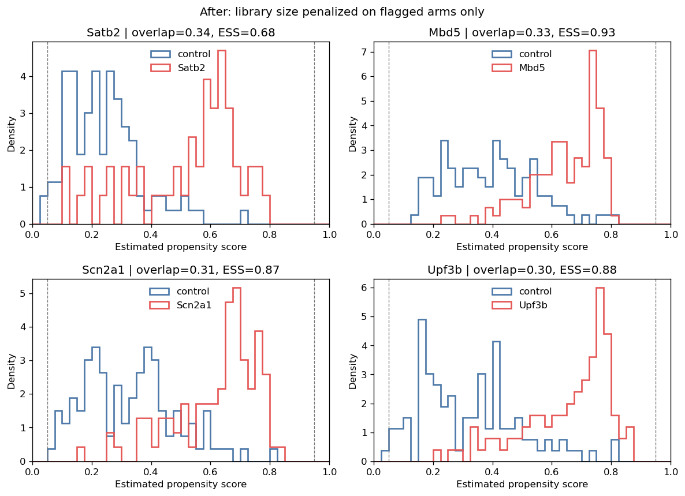

```{r setup, include=FALSE}
knitr::opts_chunk$set(echo = TRUE)
```

# Perturb-seq Tutorial (R)

This tutorial uses an excitatory-neuron subset from [Jin et al. (2020), *Science*](https://doi.org/10.1126/science.aaz6063), which studied gene perturbations in the developing mouse brain. Data are available from the [Broad Single Cell Portal](https://singlecell.broadinstitute.org/single_cell/study/SCP1184).

The workflow is **prepare counts and treatment indicators → fit latent factors → check propensity support and refit where it fails → estimate log-fold changes**. Support is checked before the effects are read, because an arm whose weights concentrate can report a discovery count that reflects the weights rather than the biology. Saved outputs illustrate one run; counts and rankings may change after refitting.

```{r}
library(Seurat)

sc.seurat <- readRDS("data/perturbseq-exneu.rds")

# Access the counts through Seurat when its installed version recognizes the
# serialized Assay5 object; otherwise recover the same layer and dimnames
# directly. The fallback keeps this tutorial runnable with older Seurat builds.
if ("RNA" %in% Assays(sc.seurat)) {
  counts <- GetAssayData(sc.seurat, assay = "RNA", layer = "counts")
} else {
  rna.assay <- sc.seurat@assays[["RNA"]]
  counts <- rna.assay@layers[["counts"]]
  rownames(counts) <- rownames(rna.assay@features)
  colnames(counts) <- rownames(rna.assay@cells)
}
Y <- data.frame(t(as.matrix(counts)), check.names = FALSE) # cell-by-gene matrix
metadata <- sc.seurat@meta.data

perturb <- metadata
colnames(perturb) <- gsub("Perturbation", "trt_", colnames(perturb))
perturb$trt_ <- relevel(as.factor(perturb$trt_), ref = "GFP")
A <- data.frame(
  model.matrix(~ trt_ - 1, data = perturb)[, -1, drop = FALSE],
  check.names = FALSE
) # cell-by-trt matrix; remove the first (GFP control) column
colnames(A) <- sub("^trt_", "", colnames(A))
```

## Prepare inputs

Use `Y` for cell-by-gene counts, `A` for perturbation indicators, and `X`/`X_A` for outcome/propensity covariates. GFP control cells have all-zero treatment indicators. `prep_causarray_data` prepares the designs, including an intercept and log-library size in the propensity model.

Use `reticulate` to call the Python package from R. The R environment is defined in `environment-r.yaml`; `use_condaenv` selects the Python environment.

```{r}
require(reticulate)
Sys.setenv(PYTHONUNBUFFERED = TRUE)
use_condaenv('causarray')
causarray <- import("causarray")
cat(causarray$`__version__`)

# (Y, A) should be either data.frame or matrix
# optional covariates can be provided as matrices
dat <- causarray$prep_causarray_data(Y, A)
names(dat) <- c("Y", "A", "X", "X_A")
list2env(dat, .GlobalEnv)
```


## Estimate latent factors

This example uses a fixed illustrative rank, matching the Python fitting cell. Inspect the JIC curve and nearby ranks in the Python example before changing it. GCATE factors represent shared expression variation; their interpretation as confounders depends on the model assumptions.

```{r}
r <- 10
# Use the same early-stopping settings as the Python example.
# Equivalent results also require matching inputs and package versions.
res_gate <- causarray$fit_gcate(
  Y, X, A, r, verbose = TRUE,
  kwargs_es_1 = list(rel_tol = 2e-4, max_iters = 30L),
  kwargs_es_2 = list(rel_tol = 2e-4, max_iters = 30L)
) # a list of results from 2 stages optimization
U <- res_gate[[2]]$U
# reticulate returns `hist` as an R list, so unlist() before min().
cat(sprintf("Step 1 -- epochs: %d, best NLL: %.6f\n",
            as.integer(res_gate[[1]]$n_iter), min(unlist(res_gate[[1]]$hist))))
cat(sprintf("Step 2 -- epochs: %d, best NLL: %.6f\n",
            as.integer(res_gate[[2]]$n_iter), min(unlist(res_gate[[2]]$hist))))
```

### Treatment-association diagnostics

The summary compares each perturbation with shared controls using Spearman correlations and standardized mean differences. P-values are BH-adjusted across treatment–covariate pairs by default. Association alone does not identify a confounder or justify removing a covariate.

Library size and latent factors are derived from the measured transcriptome and may reflect perturbation responses as well as technical variation. Their causal role requires scientific justification. Factor labels refer to this fit; they need not retain the same meaning after refitting.

```{r association-diagnostics}
W_A <- cbind(X_A, U)
factor_names <- paste0("U", seq_len(ncol(U)))
propensity_names <- c("intercept", "log_library_size", factor_names)
propensity_types <- c("observed", "observed", rep("latent", ncol(U)))

association_summary <- causarray$summarize_treatment_associations(
  A, W_A,
  covariate_names = propensity_names,
  covariate_types = propensity_types
)
observed_associations <- subset(
  association_summary, covariate_type == "observed" & !constant
)
observed_associations <- observed_associations[
  order(observed_associations$padj),
]
head(observed_associations, 10)

latent_associations <- subset(
  association_summary, covariate_type == "latent"
)
latent_associations$abs_smd <- abs(
  latent_associations$standardized_mean_difference
)
latent_associations <- latent_associations[
  order(-latent_associations$abs_smd),
]
head(subset(latent_associations, select = -abs_smd), 10)
```

```{r association-heatmap, echo=TRUE}
dir.create(
  "perturbseq-r_files/figure-markdown_github",
  recursive = TRUE, showWarnings = FALSE
)
association_plot <- causarray$plot_treatment_associations(
  association_summary
)
association_plot[[1]]$savefig(
  "perturbseq-r_files/figure-markdown_github/treatment-associations-1.png",
  dpi = 120L, bbox_inches = "tight"
)
knitr::asis_output(
  ""
)
```

### Propensity-score diagnostics and refit

Read this before the effects: an arm whose weights concentrate on a few cells reports a discovery count that reflects the weights rather than the biology. Estimate five-fold out-of-fold logistic scores, where each cell's treatment label is held out of its propensity fit. The latent factors were estimated using the full dataset, so this is conditional validation of the propensity model, not cross-fitting of the entire workflow. Unweighted logistic fits match the model class used by default in `LFC`; they do not guarantee calibrated probabilities.

The table reports histogram overlap, scores outside the display interval `[0.05, 0.95]`, Brier prediction error, and inverse-weight effective sample size (ESS). There is no universal overlap cutoff. For weights $w_i$, Kish's ESS is

$$\mathrm{ESS} = \frac{(\sum_i w_i)^2}{\sum_i w_i^2},$$

using $1/\hat\pi_i$ for treated cells and $1/(1-\hat\pi_i)$ for controls. A low ESS fraction indicates concentrated weights. Inspect both arms; neither a high ESS nor greater score overlap establishes adequate confounding adjustment. See [Cole and Hernán](https://doi.org/10.1093/aje/kwn164) for discussion of weighting assumptions and diagnostics.

Pass `clip_bounds = NULL` for these raw scores; clipping cannot be inferred from their values alone.

```{r propensity-diagnostics}
pi_oof <- causarray$estimate_propensity_scores(
  A, W_A, K = 5L, random_state = 0L
)
ps_summary <- causarray$summarize_propensity_scores(
  A, pi_oof, clip_bounds = NULL
)
ps_summary <- ps_summary[order(ps_summary$overlap_ratio),]
head(ps_summary[, c(
  "treatment", "n_treated", "overlap_ratio", "outside_overlap_fraction",
  "ess_control_fraction", "ess_treated_fraction", "brier_score"
)], 8)

weakest <- head(ps_summary$treatment, 4)
propensity_plot <- causarray$plot_propensity_scores(
  A, pi_oof, treatments = as.list(weakest), clip_bounds = NULL
)
propensity_plot[[1]]$savefig(
  "perturbseq-r_files/figure-markdown_github/propensity-overlap-1.png",
  dpi = 120L, bbox_inches = "tight"
)
knitr::asis_output(
  ""
)
```


### Tuning the library-size penalty

`prep_causarray_data` appends standardized log library size to `X_A`. For a few perturbations it differs enough between the perturbed and control cells that the propensity model can tell them apart almost perfectly. Measured library size mixes capture depth with total RNA content, and these data do not identify which of the two drives a given arm's shift, so how much to adjust for it is a modelling choice rather than a settled one.

`tune_penalty_factor` penalizes **that coefficient alone**, and only for arms failing a pre-specified support check. Dropping the covariate is the infinite-penalty limit, so it bounds what any finite factor can achieve: the search evaluates that endpoint first, then returns the smallest factor meeting the target. The report shows both, so the penalty can be read against the limit rather than on its own.

Choose the target to match the failure. These arms lose histogram overlap while keeping most of their treated sample, so overlap is the target; a screen whose arms instead lose effective sample would target that.

```{r penalty-tuning}
pi_before <- causarray$estimate_propensity_scores(
  A, W_A, K = 1L, C = 1.0, class_weight = NULL, clip = NULL, random_state = 0L
)
tuned <- causarray$tune_penalty_factor(
  A, W_A, "log_library_size",
  covariate_names = propensity_names,
  trigger = list(auc_gt = 0.9, ess_treated_fraction_lt = 0.5),
  target = list(overlap_ratio_gt = 0.3),
  K = 1L, C = 1.0, class_weight = NULL, random_state = 0L
)
penalty_factors <- tuned[[1]]
tuning_report <- tuned[[2]]
tuning_report[order(-tuning_report$penalty_factor), c(
  "treatment", "penalty_factor", "feasible", "n_fits",
  "overlap_ratio_unpenalized", "overlap_ratio_chosen",
  "overlap_ratio_dropped", "auc_unpenalized", "auc_chosen"
)]
```

```{r penalty-refit}
refit <- causarray$refit_propensity_scores(
  A, W_A, pi_hat = pi_before, covariate_names = propensity_names,
  penalty_factors_by_treatment = penalty_factors,
  K = 1L, C = 1.0, class_weight = NULL, clip = NULL, random_state = 0L
)
pi_after <- refit[[1]]

support_after <- causarray$summarize_propensity_scores(
  A, pi_after, clip_bounds = NULL
)
support_after <- support_after[support_after$treatment %in% names(penalty_factors), c(
  "treatment", "overlap_ratio", "auc", "ess_treated_fraction"
)]
support_after

tuned_plot <- causarray$plot_propensity_scores(
  A, pi_after, treatments = as.list(weakest), clip_bounds = NULL
)
invisible(tuned_plot[[1]]$suptitle(
  "After: library size penalized on flagged arms only", y = 1.02
))
tuned_plot[[1]]$savefig(
  "perturbseq-r_files/figure-markdown_github/propensity-overlap-tuned-1.png",
  dpi = 120L, bbox_inches = "tight"
)
knitr::asis_output(
  ""
)
```

### Estimate log-fold changes

`LFC` combines outcome predictions and propensity scores to estimate adjusted log-fold changes. Reuse the GCATE size factors so both stages use the same normalization. Inference uses the AIPW influence-function variance with small-sample adjustments and a size-factor-aware Poisson variance floor; see the `LFC` documentation for details.

```{r}
offsets <- log(res_gate[[2]][['kwargs_glm']][['size_factor']]) # use the precomputed size factors
# pi_hat carries the tuned propensity from the section above, so the estimate
# and the diagnostics describe the same scores.
res <- causarray$LFC(Y, cbind(X, U), A, W_A, offset = offsets,
                     pi_hat = pi_after, verbose = TRUE)
```

```{r}
names(res) <- c("df_res", "estimation")
list2env(res, .GlobalEnv)
```

### Covariate filtering for one treatment

The tuner above adjusts how strongly one coefficient is penalized. `refit_propensity_scores` can also remove a covariate from a single treatment's propensity design, which is a different operation: a penalty shrinks a coefficient the data cannot support, whereas dropping asserts the covariate does not belong in that model.

Satb2 is used here to show the mechanics: remove U9 or U8, raise the library-size penalty, or shrink every coefficient with a smaller `C`. These are illustrative settings for reading the audit output, not candidates to choose among by discovery count; recheck factor associations after refitting.

Only Satb2's scores change. Out-of-fold fits supply the diagnostics, while separate in-sample fits supply the variant LFC estimates using the primary fit's cached outcome predictions. Removing a factor here does not remove it from the outcome model.

```{r satb2-filtering}
satb2_variants <- list(
  `drop U9` = list(drop_by_treatment = list(Satb2 = "U9")),
  `drop U8` = list(drop_by_treatment = list(Satb2 = "U8")),
  `10x library penalty` = list(
    penalty_factors_by_treatment = list(Satb2 = list(log_library_size = 10))
  ),
  `Satb2 C=0.1` = list(drop_by_treatment = list(Satb2 = list()), C = 0.1)
)

refit_satb2 <- function(pi_hat, K, options) {
  do.call(causarray$refit_propensity_scores, c(
    list(A, W_A, pi_hat = pi_hat, covariate_names = propensity_names,
         K = K, random_state = 0L),
    options
  ))
}

# Out-of-fold scores drive the overlap diagnostics.
oof_variants <- lapply(satb2_variants, function(options) {
  refit_satb2(pi_oof, 5L, options)
})

do.call(rbind, lapply(names(oof_variants), function(name) {
  audit <- oof_variants[[name]][[2]]
  data.frame(
    model = name,
    n_retained = audit$n_retained,
    degenerate_design = audit$degenerate_design,
    score_std = round(audit$score_std, 3)
  )
}))

satb2_row <- function(scores, name) {
  ps <- causarray$summarize_propensity_scores(A, scores, clip_bounds = NULL)
  transform(subset(ps, treatment == "Satb2"), model = name)
}
satb2_overlap <- rbind(
  satb2_row(pi_oof, "all factors"),
  do.call(rbind, lapply(names(oof_variants), function(name) {
    satb2_row(oof_variants[[name]][[1]], name)
  }))
)
satb2_overlap[, c(
  "model", "overlap_ratio", "outside_overlap_fraction",
  "ess_control_fraction", "ess_treated_fraction", "brier_score"
)]

regularized_plot <- causarray$plot_propensity_scores(
  A, oof_variants[["Satb2 C=0.1"]][[1]],
  treatments = list("Satb2"), clip_bounds = NULL
)
invisible(regularized_plot[[1]]$suptitle(
  "Satb2 after C=0.1 regularization", y = 1.02
))
regularized_plot[[1]]$savefig(
  "perturbseq-r_files/figure-markdown_github/satb2-c01-regularized-1.png",
  dpi = 120L, bbox_inches = "tight"
)
knitr::asis_output(
  ""
)

# Analysis scores reuse the cached outcome model, so no outcome model is refitted.
satb2_all <- subset(
  df_res, trt == "Satb2", select = c(gene_names, tau, padj)
)
names(satb2_all)[-1] <- c("tau_all", "padj_all")

variant_summary <- do.call(rbind, lapply(names(satb2_variants), function(name) {
  analysis <- refit_satb2(estimation[["pi_hat_raw"]], 1L, satb2_variants[[name]])
  fit <- causarray$LFC(
    Y, cbind(X, U), A, W_A,
    offset = offsets,
    Y_hat = estimation[["Y_hat"]], pi_hat = analysis[[1]]
  )
  alternative <- subset(
    fit[[1]], trt == "Satb2", select = c(gene_names, tau, padj)
  )
  merged <- merge(satb2_all, alternative, by = "gene_names")
  data.frame(
    model = name,
    effect_correlation = cor(merged$tau_all, merged$tau),
    median_absolute_change = median(abs(merged$tau_all - merged$tau)),
    discoveries = sum(merged$padj < 0.1, na.rm = TRUE)
  )
}))
variant_summary$discoveries_all <- sum(satb2_all$padj_all < 0.1, na.rm = TRUE)
variant_summary


```

### Reading the filtering comparison

The saved examples show that removing a factor can reduce control ESS even when histogram overlap improves. Stronger penalties give less concentrated weights, but their out-of-fold Brier scores are worse. The effect estimates remain broadly correlated with the primary fit, while some discovery decisions change.

That is a tradeoff, not evidence that one variant is more trustworthy. Read prediction, weight concentration, and effect stability together, and do not pick a design to raise overlap or discovery counts. Keep factor removal for cases with a scientific reason to change the adjustment set, and re-examine the pattern in a new run rather than carrying a fixed `C` across datasets.

## Discovery summary

The plot reports genes passing the chosen BH-adjusted threshold for each perturbation. Counts describe this fit and can change across runs.

```{r, fig.width=12, fig.height=6}
library(dplyr)
library(ggplot2)

# Filter the results for significant discoveries
significant_discoveries <- df_res[df_res$padj < 0.1, ]

# Count the number of discoveries for each perturbation condition
discovery_counts <- as.data.frame(table(significant_discoveries$trt))
colnames(discovery_counts) <- c('Perturbation', 'Count')

# Order the discovery_counts by Count in descending order
discovery_counts <- discovery_counts %>% arrange(desc(Count))

# Set the factor levels of Perturbation to ensure ggplot respects the order
discovery_counts$Perturbation <- factor(discovery_counts$Perturbation, levels = discovery_counts$Perturbation)

# Plot the number of discoveries for each perturbation condition
ggplot(discovery_counts, aes(x = Perturbation, y = Count)) +
  geom_bar(stat = "identity", fill = "royalblue") +  theme(axis.text.x = element_text(angle = 90, hjust = 1)) +
  ggtitle('Number of Discoveries (padj < 0.1) for Each Perturbation Condition') +
  xlab('Perturbation Condition') +
  ylab('Number of Discoveries')
```
