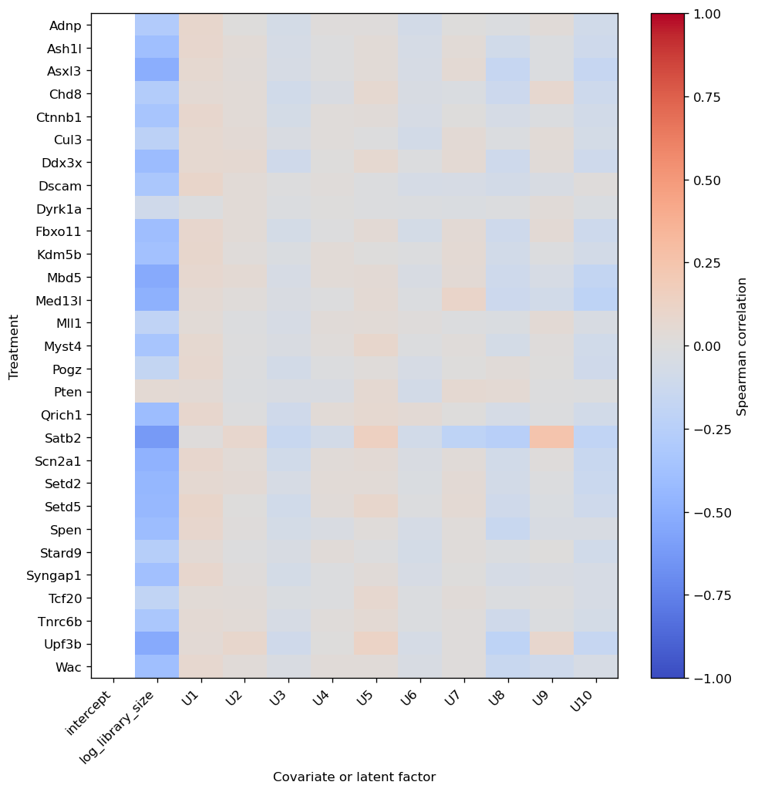
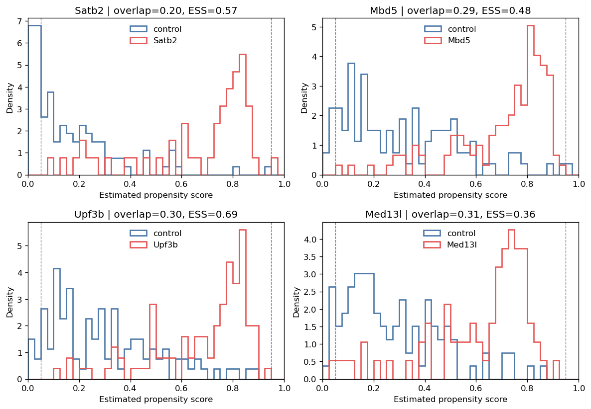
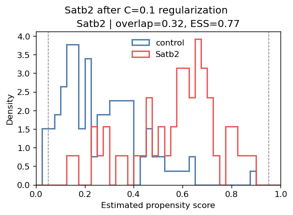
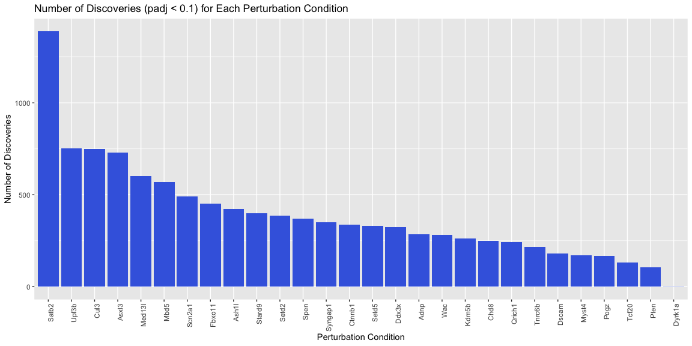

# Perturb-seq Tutorial (R)

The original data of Jin et al 2020 can be downloaded from the Broad
single cell portal
(<https://singlecell.broadinstitute.org/single_cell/study/SCP1184>).
Here, we just use a subset of the data to demonstrate the workflow of
the analysis.

``` r
library(Seurat)
```

    ## Loading required package: SeuratObject

    ## Loading required package: sp

    ## 'SeuratObject' was built under R 4.4.1 but the current version is
    ## 4.4.2; it is recomended that you reinstall 'SeuratObject' as the ABI
    ## for R may have changed

    ## 'SeuratObject' was built with package 'Matrix' 1.6.5 but the current
    ## version is 1.7.2; it is recomended that you reinstall 'SeuratObject' as
    ## the ABI for 'Matrix' may have changed

    ## 
    ## Attaching package: 'SeuratObject'

    ## The following objects are masked from 'package:base':
    ## 
    ##     intersect, t

``` r
sc.seurat <- readRDS("perturbseq-exneu.rds")

# Access the counts through Seurat when its installed version recognizes the
# serialized Assay5 object; otherwise recover the same layer and dimnames
# directly. The fallback keeps this tutorial runnable with older Seurat builds.
if ("RNA" %in% Assays(sc.seurat)) {
  counts <- GetAssayData(sc.seurat, assay = "RNA", layer = "counts")
} else {
  rna.assay <- sc.seurat@assays[["RNA"]]
  counts <- rna.assay@layers[["counts"]]
  rownames(counts) <- rownames(rna.assay@features)
  colnames(counts) <- rownames(rna.assay@cells)
}
Y <- data.frame(t(as.matrix(counts)), check.names = FALSE) # cell-by-gene matrix
metadata <- sc.seurat@meta.data

perturb <- metadata
colnames(perturb) <- gsub("Perturbation", "trt_", colnames(perturb))
perturb$trt_ <- relevel(as.factor(perturb$trt_), ref = "GFP")
A <- data.frame(
  model.matrix(~ trt_ - 1, data = perturb)[, -1, drop = FALSE],
  check.names = FALSE
) # cell-by-trt matrix; remove the first (GFP control) column
colnames(A) <- sub("^trt_", "", colnames(A))
```

For running causarray, we require the following inputs:

-   `Y`: the cell-by-gene gene expression matrix.
-   `A`: the cell-by-condition binary matrix of the
    perturbation/treatment conditions.
-   `X, X_A`: (optional) the cell-by-covariate matrix of the covariates
    of interest for outcome and propensity models.

Here, `Y` and `A` can be dataframes.

Use R package `reticulate` to load the Python package `causarray`.
Render this tutorial from the `causarray-r` environment defined by
`environment-r.yaml`; reticulate then connects to the NumPy-2-based
Python `causarray` environment.

``` r
require(reticulate)
```

    ## Loading required package: reticulate

``` r
Sys.setenv(PYTHONUNBUFFERED = TRUE)
use_condaenv('causarray')
causarray <- import("causarray")
cat(causarray$`__version__`)
```

    ## 0.0.10

``` r
# (Y, A) should be either data.frame or matrix
# optional covariates can be provided as matrices
dat <- causarray$prep_causarray_data(Y, A)
names(dat) <- c("Y", "A", "X", "X_A")
list2env(dat, .GlobalEnv)
```

    ## <environment: R_GlobalEnv>

We first apply gcate to estimate unmeasured confounders.

``` r
r <- 10
# Same early-stopping settings as the Python tutorial, so both produce
# identical latent factors on this dataset.
res_gate <- causarray$fit_gcate(
  Y, X, A, r, verbose = TRUE,
  kwargs_es_1 = list(rel_tol = 2e-4, max_iters = 30L),
  kwargs_es_2 = list(rel_tol = 2e-4, max_iters = 30L)
) # a list of results from 2 stages optimization
```

    ## {'d': 30, 'n': 2926, 'p': 3221, 'r': 10}
    ## 'Estimating initial latent variables with GLMs...'
    ## 'Fitting nb GLM (fast)...'
    ## 'Estimating initial coefficients with GLMs...'
    ## 'Fitting nb GLM (fast)...'
    ## {'kwargs_es': {'max_iters': 30,
    ##                'patience': 5,
    ##                'rel_tol': 0.0002,
    ##                'tolerance': 0.0,
    ##                'warmup': 0},
    ##  'kwargs_glm': {'disp_glm': array([ 1.11673516,  1.06870944,  1.16716468, ..., 12.58818245,
    ##        16.46897663,  1.70852614]),
    ##                 'family': 'nb',
    ##                 'size_factor': array([0.53193358, 0.87362742, 1.2235467 , ..., 0.5593801 , 0.73025856,
    ##        0.77857223])},
    ##  'kwargs_ls': {'C': 1000.0,
    ##                'alpha': 0.1,
    ##                'beta': 0.5,
    ##                'max_iters': 20,
    ##                'recheck_interval': 10,
    ##                'sparsity_boost': 2.0,
    ##                'sparsity_threshold': 0.5,
    ##                'tol': 0.0001,
    ##                'tol_cell': 0.0001,
    ##                'tol_gene': 0.0001,
    ##                'warmup_iters': 0}}
    ## 'Fitting GCATE (step 1)...'
    ## {'d': 30, 'n': 2926, 'p': 3221, 'r': 10}
    ## {'kwargs_es': {'max_iters': 30,
    ##                'patience': 5,
    ##                'rel_tol': 0.0002,
    ##                'tolerance': 0.0,
    ##                'warmup': 0},
    ##  'kwargs_glm': {'disp_glm': array([ 1.11673516,  1.06870944,  1.16716468, ..., 12.58818245,
    ##        16.46897663,  1.70852614]),
    ##                 'family': 'nb',
    ##                 'size_factor': array([0.53193358, 0.87362742, 1.2235467 , ..., 0.5593801 , 0.73025856,
    ##        0.77857223])},
    ##  'kwargs_ls': {'C': 1000.0,
    ##                'alpha': 0.1,
    ##                'beta': 0.5,
    ##                'max_iters': 20,
    ##                'recheck_interval': 10,
    ##                'sparsity_boost': 2.0,
    ##                'sparsity_threshold': 0.5,
    ##                'tol': 0.0001,
    ##                'tol_cell': 0.0001,
    ##                'tol_gene': 0.0001,
    ##                'warmup_iters': 0}}
    ## 'Fitting GCATE (step 2)...'

``` r
U <- res_gate[[2]]$U
# reticulate returns `hist` as an R list, so unlist() before min().
cat(sprintf("Step 1 -- epochs: %d, best NLL: %.6f\n",
            as.integer(res_gate[[1]]$n_iter), min(unlist(res_gate[[1]]$hist))))
```

    ## Step 1 -- epochs: 29, best NLL: 1.705777

``` r
cat(sprintf("Step 2 -- epochs: %d, best NLL: %.6f\n",
            as.integer(res_gate[[2]]$n_iter), min(unlist(res_gate[[2]]$hist))))
```

    ## Step 2 -- epochs: 29, best NLL: 1.722559

Next, we apply causarray to estimate the causal effects of perturbations
on gene expression. Since causarray 0.0.10, `LFC` uses the
influence-function variance of the AIPW estimator for every design (the
former `usevar` choice between pooled and Welch variances is gone; see
the LFC documentation), with calibrated propensity scores and a
model-based variance floor. The 106 GFP control cells and the
perturbation groups (median 89 cells) are similar in size, so the
calibrated scores coincide almost exactly with the class-balanced scores
used in earlier versions of this tutorial and the results are
essentially unchanged.

``` r
offsets <- log(res_gate[[2]][['kwargs_glm']][['size_factor']]) # use the precomputed size factors
res <- causarray$LFC(Y, cbind(X, U), A, cbind(X_A, U), offset=offsets, verbose=TRUE)
```

    ## 'Estimating LFC...'
    ## {'a': 29, 'd': 11, 'd_A': 12, 'estimands': 'LFC', 'n': 2926, 'p': 3221}
    ## {'offset': array([-0.63123664, -0.13510128,  0.20175377, ..., -0.58092607,
    ##        -0.31435661, -0.25029351]),
    ##  'random_state': 0,
    ##  'verbose': True}
    ## 'Fit propensity score models...'
    ## {'C': 1.0,
    ##  'class_weight': None,
    ##  'fit_intercept': False,
    ##  'random_state': 0,
    ##  'verbose': False}
    ## 'Fit outcome models...'
    ## 'Fitting nb GLM (fast)...'
    ## ('Fast GLM coefficients exceed bound (max|B|=1.53e+05 > 1e+04); falling back '
    ##  'to statsmodels...')
    ## 'Estimating dispersion parameter...'
    ## 'Fitting poisson GLM with offset...'
    ## 'Fitting nb GLM with offset...'
    ## 'Fitting GLM done.'
    ## 'Estimating AIPW mean...'

``` r
names(res) <- c("df_res", "estimation")
list2env(res, .GlobalEnv)
```

    ## <environment: R_GlobalEnv>

## Diagnose treatment associations and overlap

Positivity requires treated and control cells with comparable
covariates. The propensity design holds the observed covariates built by
`prep_causarray_data` (the intercept and standardized log-library size)
together with the estimated latent factors. The association summary
compares each perturbation with the shared all-zero GFP controls,
BH-adjusting across every treatment-by-covariate pair; pass
`bh_scope = "per_treatment"` to adjust within each treatment instead.
These are diagnostics only — association alone is not a reason to drop
an observed covariate.

``` r
W_A <- cbind(X_A, U)
factor_names <- paste0("U", seq_len(ncol(U)))
propensity_names <- c("intercept", "log_library_size", factor_names)
propensity_types <- c("observed", "observed", rep("latent", ncol(U)))

association_summary <- causarray$summarize_treatment_associations(
  A, W_A,
  covariate_names = propensity_names,
  covariate_types = propensity_types
)
observed_associations <- subset(
  association_summary, covariate_type == "observed" & !constant
)
observed_associations <- observed_associations[
  order(observed_associations$padj),
]
head(observed_associations, 10)
```

    ##     treatment        covariate covariate_type n_control n_treated spearman_rho
    ## 218     Satb2 log_library_size       observed       106        51   -0.6206012
    ## 134      Mbd5 log_library_size       observed       106       119   -0.5251680
    ## 26      Asxl3 log_library_size       observed       106       130   -0.5011708
    ## 326     Upf3b log_library_size       observed       106       100   -0.5244644
    ## 230    Scn2a1 log_library_size       observed       106        93   -0.4791687
    ## 146    Med13l log_library_size       observed       106        75   -0.4911242
    ## 242     Setd2 log_library_size       observed       106        76   -0.4504232
    ## 14      Ash1l log_library_size       observed       106       122   -0.3905315
    ## 254     Setd5 log_library_size       observed       106        71   -0.4383442
    ## 110    Fbxo11 log_library_size       observed       106       111   -0.3943441
    ##           pvalue         padj standardized_mean_difference constant
    ## 218 4.352985e-18 1.388602e-15                   -1.6704318    FALSE
    ## 134 2.377952e-17 3.792833e-15                   -1.1965476    FALSE
    ## 26  2.061826e-16 2.192409e-14                   -1.1478666    FALSE
    ## 326 5.917208e-16 4.718973e-14                   -1.1938053    FALSE
    ## 230 8.091610e-13 5.162447e-11                   -1.0708596    FALSE
    ## 146 2.226940e-12 1.183990e-10                   -1.0729179    FALSE
    ## 242 1.771080e-10 8.071064e-09                   -0.9716459    FALSE
    ## 14  1.003845e-09 3.710293e-08                   -0.8068996    FALSE
    ## 254 1.046791e-09 3.710293e-08                   -0.9526579    FALSE
    ## 110 1.730357e-09 5.519838e-08                   -0.8442098    FALSE
    ##     n_tests_in_family
    ## 218               319
    ## 134               319
    ## 26                319
    ## 326               319
    ## 230               319
    ## 146               319
    ## 242               319
    ## 14                319
    ## 254               319
    ## 110               319

``` r
latent_associations <- subset(
  association_summary, covariate_type == "latent"
)
latent_associations$abs_smd <- abs(
  latent_associations$standardized_mean_difference
)
latent_associations <- latent_associations[
  order(-latent_associations$abs_smd),
]
head(subset(latent_associations, select = -abs_smd), 10)
```

    ##     treatment covariate covariate_type n_control n_treated spearman_rho
    ## 227     Satb2        U9         latent       106        51    0.2472800
    ## 228     Satb2       U10         latent       106        51   -0.1902615
    ## 156    Med13l       U10         latent       106        75   -0.2054220
    ## 226     Satb2        U8         latent       106        51   -0.2424784
    ## 144      Mbd5       U10         latent       106       119   -0.1750560
    ## 153    Med13l        U7         latent       106        75    0.1019597
    ## 36      Asxl3       U10         latent       106       130   -0.1608048
    ## 225     Satb2        U7         latent       106        51   -0.2064668
    ## 240    Scn2a1       U10         latent       106        93   -0.1481513
    ## 336     Upf3b       U10         latent       106       100   -0.1639870
    ##          pvalue       padj standardized_mean_difference constant
    ## 227 0.001794526 0.02289815                    0.5209986    FALSE
    ## 228 0.016997402 0.15491918                   -0.4292357    FALSE
    ## 156 0.005534232 0.06087655                   -0.4113753    FALSE
    ## 226 0.002215118 0.02717780                   -0.4064899    FALSE
    ## 144 0.008499250 0.08746002                   -0.3282039    FALSE
    ## 153 0.172005959 0.88370491                    0.3197265    FALSE
    ## 36  0.013386045 0.12559260                   -0.3149056    FALSE
    ## 225 0.009476622 0.09447007                   -0.3137169    FALSE
    ## 240 0.036770525 0.30867888                   -0.2849321    FALSE
    ## 336 0.018507723 0.16399899                   -0.2724256    FALSE
    ##     n_tests_in_family
    ## 227               319
    ## 228               319
    ## 156               319
    ## 226               319
    ## 144               319
    ## 153               319
    ## 36                319
    ## 225               319
    ## 240               319
    ## 336               319

``` r
dir.create(
  "perturbseq-r_files/figure-markdown_github",
  recursive = TRUE, showWarnings = FALSE
)
association_plot <- causarray$plot_treatment_associations(
  association_summary
)
association_plot[[1]]$savefig(
  "perturbseq-r_files/figure-markdown_github/treatment-associations-1.png",
  dpi = 120L, bbox_inches = "tight"
)
knitr::asis_output(
  ""
)
```


We next estimate five-fold out-of-fold (OOF) scores with the same
calibrated logistic model `LFC` uses internally by default since
causarray 0.0.10; *out-of-fold* means each cell is scored by a model
that was not trained on it. The overlap ratio is descriptive rather than
a hard pass/fail threshold, though **0.25 is a reasonable rule-of-thumb
floor**. The table also reports the fraction of scores outside
`[0.05, 0.95]`, the effective sample size (ESS) of the
inverse-probability weights — a fraction between 0 and 1 where larger is
better — and the Brier score. These scores are raw, so we pass
`clip_bounds = NULL` and `clipped_fraction` comes back as `NA` instead
of a misleading zero.

Formally, ESS is Kish’s effective sample size of the inverse-probability
weights:

$$\mathrm{ESS} = \frac{\left(\sum_i w_i\right)^2}{\sum_i w_i^2}, \qquad w_i = \begin{cases} 1/\hat{\pi}_i & \text{treated cells} \\ 1/(1-\hat{\pi}_i) & \text{control cells,} \end{cases}$$

where $\hat{\pi}_i = P(\text{treated} \mid X_i)$ is the propensity
score. Equal weights give $\mathrm{ESS}=n$ (fraction 1); a few dominant
weights push it toward 0.

``` r
pi_oof <- causarray$estimate_propensity_scores(
  A, W_A, K = 5L, random_state = 0L
)
ps_summary <- causarray$summarize_propensity_scores(
  A, pi_oof, clip_bounds = NULL
)
ps_summary <- ps_summary[order(ps_summary$overlap_ratio),]
head(ps_summary[, c(
  "treatment", "n_treated", "overlap_ratio", "outside_overlap_fraction",
  "ess_control_fraction", "ess_treated_fraction", "brier_score"
)], 8)
```

    ##    treatment n_treated overlap_ratio outside_overlap_fraction
    ## 19     Satb2        51     0.2040326               0.23566879
    ## 12      Mbd5       119     0.2896781               0.04000000
    ## 28     Upf3b       100     0.2998113               0.02912621
    ## 13    Med13l        75     0.3132075               0.04972376
    ## 20    Scn2a1        93     0.3376953               0.03517588
    ## 3      Asxl3       130     0.3400581               0.02542373
    ## 2      Ash1l       122     0.3784411               0.00000000
    ## 21     Setd2        76     0.3803376               0.02747253
    ##    ess_control_fraction ess_treated_fraction brier_score
    ## 19            0.4926128            0.5723399  0.09376838
    ## 12            0.3444534            0.4770812  0.13461683
    ## 28            0.6602025            0.6925812  0.13564272
    ## 13            0.7649239            0.3625839  0.14678499
    ## 20            0.6793838            0.5280640  0.14820618
    ## 3             0.5074605            0.8907966  0.13245436
    ## 2             0.5582662            0.7187160  0.17494143
    ## 21            0.6747610            0.7104954  0.17299321

``` r
weakest <- head(ps_summary$treatment, 4)
propensity_plot <- causarray$plot_propensity_scores(
  A, pi_oof, treatments = as.list(weakest), clip_bounds = NULL
)
propensity_plot[[1]]$savefig(
  "perturbseq-r_files/figure-markdown_github/propensity-overlap-1.png",
  dpi = 120L, bbox_inches = "tight"
)
knitr::asis_output(
  ""
)
```


Satb2 has the weakest overlap: its latent-factor diagnostics flag both
U8 and U9, and standardized log-library size is strongly associated with
it as well. Propensity scores are fit one treatment at a time against
the shared controls, so you can change the model for Satb2 alone and
leave the other 28 perturbations untouched. `refit_propensity_scores`
refits only the treatments you name and returns an audit table next to
the updated scores. Four alternatives:

-   **drop U9** — remove the single most imbalanced latent factor;
-   **drop U8** — remove the other flagged latent factor instead;
-   **10x library penalty** — keep every covariate, but apply ten times
    the usual L2 penalty to standardized log-library size;
-   **Satb2 C=0.1** — keep every covariate and shrink all of them more
    strongly.

Out-of-fold scores drive the overlap diagnostics; the analysis scores
then reuse the primary fit’s cached `Y_hat`, so no outcome model is
refitted.

``` r
satb2_variants <- list(
  `drop U9` = list(drop_by_treatment = list(Satb2 = "U9")),
  `drop U8` = list(drop_by_treatment = list(Satb2 = "U8")),
  `10x library penalty` = list(
    penalty_factors_by_treatment = list(Satb2 = list(log_library_size = 10))
  ),
  `Satb2 C=0.1` = list(drop_by_treatment = list(Satb2 = list()), C = 0.1)
)

refit_satb2 <- function(pi_hat, K, options) {
  do.call(causarray$refit_propensity_scores, c(
    list(A, W_A, pi_hat = pi_hat, covariate_names = propensity_names,
         K = K, random_state = 0L),
    options
  ))
}

# Out-of-fold scores drive the overlap diagnostics.
oof_variants <- lapply(satb2_variants, function(options) {
  refit_satb2(pi_oof, 5L, options)
})

do.call(rbind, lapply(names(oof_variants), function(name) {
  audit <- oof_variants[[name]][[2]]
  data.frame(
    model = name,
    n_retained = audit$n_retained,
    degenerate_design = audit$degenerate_design,
    score_std = round(audit$score_std, 3)
  )
}))
```

    ##                 model n_retained degenerate_design score_std
    ## 1             drop U9         11             FALSE     0.302
    ## 2             drop U8         11             FALSE     0.295
    ## 3 10x library penalty         12             FALSE     0.217
    ## 4         Satb2 C=0.1         12             FALSE     0.220

``` r
satb2_row <- function(scores, name) {
  ps <- causarray$summarize_propensity_scores(A, scores, clip_bounds = NULL)
  transform(subset(ps, treatment == "Satb2"), model = name)
}
satb2_overlap <- rbind(
  satb2_row(pi_oof, "all factors"),
  do.call(rbind, lapply(names(oof_variants), function(name) {
    satb2_row(oof_variants[[name]][[1]], name)
  }))
)
satb2_overlap[, c(
  "model", "overlap_ratio", "outside_overlap_fraction",
  "ess_control_fraction", "ess_treated_fraction", "brier_score"
)]
```

    ##                   model overlap_ratio outside_overlap_fraction
    ## 19          all factors     0.2040326               0.23566879
    ## 194             drop U9     0.1938587               0.22929936
    ## 191             drop U8     0.2998520               0.24203822
    ## 192 10x library penalty     0.3274140               0.05095541
    ## 193         Satb2 C=0.1     0.3165002               0.02547771
    ##     ess_control_fraction ess_treated_fraction brier_score
    ## 19            0.49261275            0.5723399  0.09376838
    ## 194           0.50298567            0.5713871  0.09343274
    ## 191           0.05244251            0.3881510  0.12986526
    ## 192           0.82967342            0.6326174  0.13071041
    ## 193           0.75827053            0.7655063  0.13478011

``` r
regularized_plot <- causarray$plot_propensity_scores(
  A, oof_variants[["Satb2 C=0.1"]][[1]],
  treatments = list("Satb2"), clip_bounds = NULL
)
invisible(regularized_plot[[1]]$suptitle(
  "Satb2 after C=0.1 regularization", y = 1.02
))
regularized_plot[[1]]$savefig(
  "perturbseq-r_files/figure-markdown_github/satb2-c01-regularized-1.png",
  dpi = 120L, bbox_inches = "tight"
)
knitr::asis_output(
  ""
)
```


``` r
# Analysis scores reuse the cached outcome model, so no outcome model is refitted.
satb2_all <- subset(
  df_res, trt == "Satb2", select = c(gene_names, tau, padj)
)
names(satb2_all)[-1] <- c("tau_all", "padj_all")

sensitivity_summary <- do.call(rbind, lapply(names(satb2_variants), function(name) {
  analysis <- refit_satb2(estimation[["pi_hat_raw"]], 1L, satb2_variants[[name]])
  fit <- causarray$LFC(
    Y, cbind(X, U), A, W_A,
    offset = offsets,
    Y_hat = estimation[["Y_hat"]], pi_hat = analysis[[1]]
  )
  alternative <- subset(
    fit[[1]], trt == "Satb2", select = c(gene_names, tau, padj)
  )
  merged <- merge(satb2_all, alternative, by = "gene_names")
  data.frame(
    model = name,
    effect_correlation = cor(merged$tau_all, merged$tau),
    median_absolute_change = median(abs(merged$tau_all - merged$tau)),
    discoveries = sum(merged$padj < 0.1, na.rm = TRUE)
  )
}))
sensitivity_summary$discoveries_all <- sum(satb2_all$padj_all < 0.1, na.rm = TRUE)
sensitivity_summary
```

    ##                 model effect_correlation median_absolute_change discoveries
    ## 1             drop U9          0.9998566            0.003138781        1395
    ## 2             drop U8          0.9047749            0.088186924         830
    ## 3 10x library penalty          0.9832344            0.015366168        1321
    ## 4         Satb2 C=0.1          0.9748820            0.014572478        1326
    ##   discoveries_all
    ## 1            1389
    ## 2            1389
    ## 3            1389
    ## 4            1389

``` r
baseline_overlap <- subset(satb2_overlap, model == "all factors")
u9_overlap <- subset(satb2_overlap, model == "drop U9")
u8_overlap <- subset(satb2_overlap, model == "drop U8")
penalty_overlap <- subset(satb2_overlap, model == "10x library penalty")
ridge_overlap <- subset(satb2_overlap, model == "Satb2 C=0.1")
u9_effects <- subset(sensitivity_summary, model == "drop U9")
u8_effects <- subset(sensitivity_summary, model == "drop U8")
penalty_effects <- subset(sensitivity_summary, model == "10x library penalty")
ridge_effects <- subset(sensitivity_summary, model == "Satb2 C=0.1")
```

**What the four variants show.** Which factor you drop matters, and
neither single drop is the answer.

Dropping U9 — the single most imbalanced factor — does essentially
nothing: overlap barely moves (0.204 to 0.194, still below the 0.25
floor, so it does not fix the problem) and the effects are unchanged
(correlation 1.000). Dropping U8 instead looks like a win — overlap
jumps to 0.300 — but it guts the control effective sample size, from
49.3% to 5.2%, and destabilises the effects (correlation 0.905,
discoveries 830); a high overlap ratio bought this way is misleading,
because the estimate now rests on almost no effective controls. That
collapse is a weight problem: dropping U8 pushes a few control cells to
propensity scores near 1, so their $1/(1-\hat{\pi}_i)$ control weights
become extreme and a handful of controls dominate the arm. So the
message is *not* “drop U9, keep U8”: dropping U9 fixes nothing and
dropping U8 does real damage. Factor-dropping is the wrong tool here —
keep all the factors and regularise instead.

Penalising the propensity model is reliable. The feature-specific 10x
library-size penalty (overlap 0.327) and, more simply, global `C = 0.1`
both raise overlap above the 0.25 rule of thumb and in line with the
other perturbations. `C = 0.1` reaches 0.317, leaves only 2.5% of scores
outside `[0.05, 0.95]`, and keeps the effective sample sizes healthy
(control 75.8%, treated 76.6%) while the effects stay stable
(correlation 0.975). The only real cost is a modest rise in the
out-of-fold Brier score, from 0.094 to 0.135.

For a small treatment (51 cells) this is a good trade. A penalised model
deliberately accepts a little bias in return for propensity scores that
are less variable and better supported, which makes the downstream
estimate more trustworthy — exactly the overlapping, in-range scores
reviewers ask for. The drop in discoveries (1,389 to 1,326) is not a
loss: a conservative, well-supported list is the goal, not the largest
one.

In practice, applying `C = 0.1` to every perturbation is a sensible
default. It gives up a little power on the well-behaved perturbations
but spares you from hand-tuning the few problem cases like Satb2 — a
good bargain when you have many analyses to run.

``` r
library(dplyr)
```

    ## 
    ## Attaching package: 'dplyr'

    ## The following objects are masked from 'package:stats':
    ## 
    ##     filter, lag

    ## The following objects are masked from 'package:base':
    ## 
    ##     intersect, setdiff, setequal, union

``` r
library(ggplot2)

# Filter the results for significant discoveries
significant_discoveries <- df_res[df_res$padj < 0.1, ]

# Count the number of discoveries for each perturbation condition
discovery_counts <- as.data.frame(table(significant_discoveries$trt))
colnames(discovery_counts) <- c('Perturbation', 'Count')

# Order the discovery_counts by Count in descending order
discovery_counts <- discovery_counts %>% arrange(desc(Count))

# Set the factor levels of Perturbation to ensure ggplot respects the order
discovery_counts$Perturbation <- factor(discovery_counts$Perturbation, levels = discovery_counts$Perturbation)

# Plot the number of discoveries for each perturbation condition
ggplot(discovery_counts, aes(x = Perturbation, y = Count)) +
  geom_bar(stat = "identity", fill = "royalblue") +  theme(axis.text.x = element_text(angle = 90, hjust = 1)) +
  ggtitle('Number of Discoveries (padj < 0.1) for Each Perturbation Condition') +
  xlab('Perturbation Condition') +
  ylab('Number of Discoveries')
```


