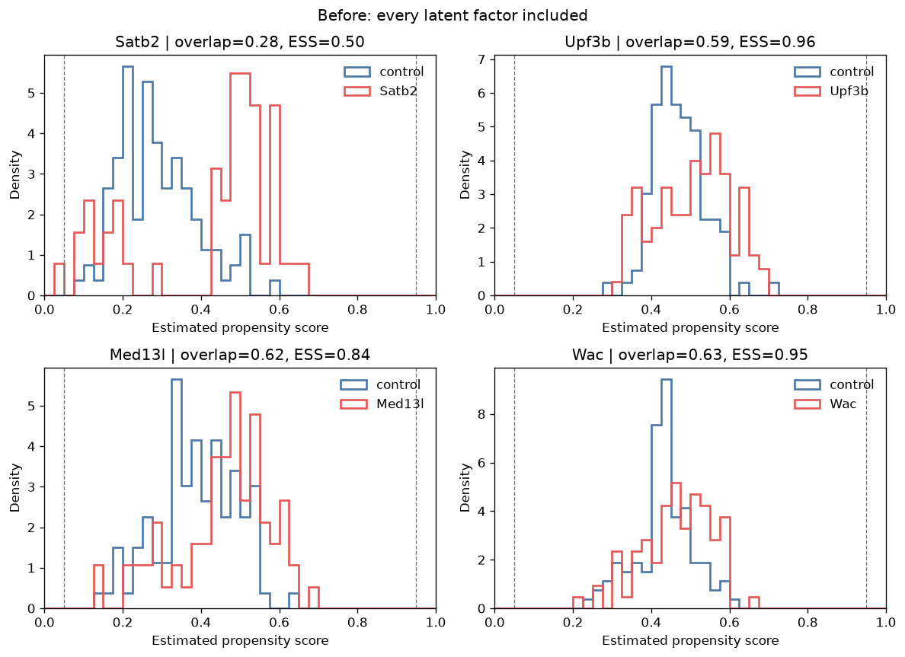
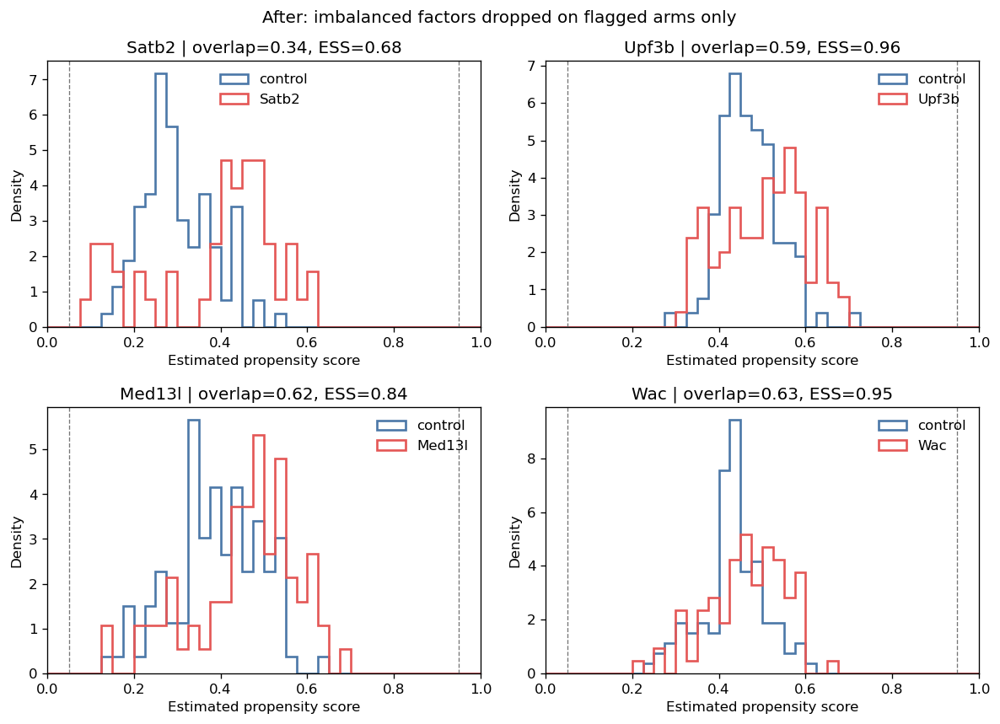
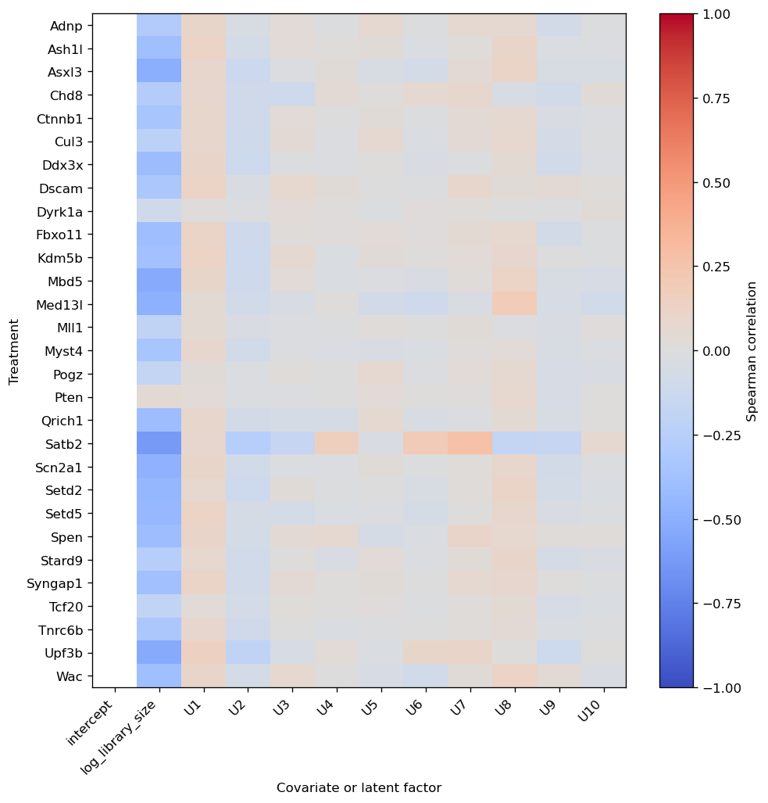
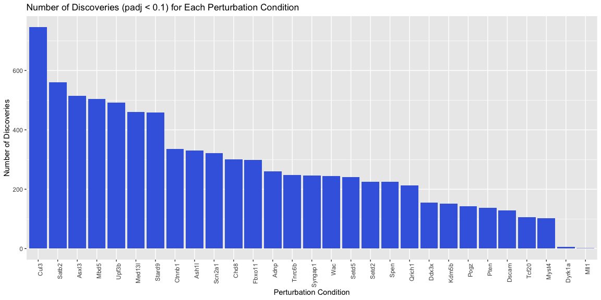

Perturb-seq Tutorial (R)
========================

This tutorial uses an excitatory-neuron subset from [Jin et al. (2020),
*Science*](https://doi.org/10.1126/science.aaz6063), which studied gene
perturbations in the developing mouse brain. Data are available from the
[Broad Single Cell
Portal](https://singlecell.broadinstitute.org/single_cell/study/SCP1184).

The workflow is **prepare counts and treatment indicators → fit latent
factors → check propensity support and refit where it fails → estimate
log-fold changes**, the same as the Python tutorial. Support is checked
before the effects are read, because an arm whose weights concentrate
can report a discovery count that reflects the weights rather than the
biology. Saved outputs illustrate one run; counts and rankings may
change after refitting.

``` r
library(Seurat)
```

    ## Loading required package: SeuratObject

    ## Loading required package: sp

    ## 
    ## Attaching package: 'SeuratObject'

    ## The following objects are masked from 'package:base':
    ## 
    ##     intersect, t

``` r
sc.seurat <- readRDS("data/perturbseq-exneu.rds")

# Access the counts through Seurat when its installed version recognizes the
# serialized Assay5 object; otherwise recover the same layer and dimnames
# directly. The fallback keeps this tutorial runnable with older Seurat builds.
if ("RNA" %in% Assays(sc.seurat)) {
  counts <- GetAssayData(sc.seurat, assay = "RNA", layer = "counts")
} else {
  rna.assay <- sc.seurat@assays[["RNA"]]
  counts <- rna.assay@layers[["counts"]]
  rownames(counts) <- rownames(rna.assay@features)
  colnames(counts) <- rownames(rna.assay@cells)
}
Y <- data.frame(t(as.matrix(counts)), check.names = FALSE) # cell-by-gene matrix
metadata <- sc.seurat@meta.data

perturb <- metadata
colnames(perturb) <- gsub("Perturbation", "trt_", colnames(perturb))
perturb$trt_ <- relevel(as.factor(perturb$trt_), ref = "GFP")
A <- data.frame(
  model.matrix(~ trt_ - 1, data = perturb)[, -1, drop = FALSE],
  check.names = FALSE
) # cell-by-trt matrix; remove the first (GFP control) column
colnames(A) <- sub("^trt_", "", colnames(A))
```

Prepare inputs
--------------

Use `Y` for cell-by-gene counts, `A` for perturbation indicators, and
`X`/`X_A` for outcome/propensity covariates. GFP control cells have
all-zero treatment indicators. `prep_causarray_data` prepares the
designs, including an intercept and log-library size in `X_A`; the
propensity section explains why the model below leaves library size out.

Use `reticulate` to call the Python package from R. The R environment is
defined in `environment-r.yaml`; `use_condaenv` selects the Python
environment.

``` r
require(reticulate)
```

    ## Loading required package: reticulate

``` r
Sys.setenv(PYTHONUNBUFFERED = TRUE)
use_condaenv('causarray')
causarray <- import("causarray")
cat(causarray$`__version__`)
```

    ## 0.1.1

``` r
# (Y, A) should be either data.frame or matrix
# optional covariates can be provided as matrices
dat <- causarray$prep_causarray_data(Y, A)
names(dat) <- c("Y", "A", "X", "X_A")
list2env(dat, .GlobalEnv)
```

    ## <environment: R_GlobalEnv>

Estimate latent factors
-----------------------

This example uses a fixed illustrative rank, matching the Python fitting
cell. Inspect the JIC curve and nearby ranks in the Python example
before changing it. GCATE factors represent shared expression variation;
their interpretation as confounders depends on the model assumptions.

``` r
r <- 10
# Use the same early-stopping settings as the Python example.
# Equivalent results also require matching inputs and package versions.
res_gate <- causarray$fit_gcate(
  Y, X, A, r, verbose = FALSE,
  kwargs_es_1 = list(rel_tol = 2e-4, max_iters = 30L),
  kwargs_es_2 = list(rel_tol = 2e-4, max_iters = 30L)
) # a list of results from 2 stages optimization
```

    ## 'Fitting GCATE (step 1)...'
    ## 'Fitting GCATE (step 2)...'

``` r
U <- res_gate[[2]]$U
# reticulate returns `hist` as an R list, so unlist() before min().
cat(sprintf("Step 1 -- epochs: %d, best NLL: %.6f\n",
            as.integer(res_gate[[1]]$n_iter), min(unlist(res_gate[[1]]$hist))))
```

    ## Step 1 -- epochs: 22, best NLL: 1.688563

``` r
cat(sprintf("Step 2 -- epochs: %d, best NLL: %.6f\n",
            as.integer(res_gate[[2]]$n_iter), min(unlist(res_gate[[2]]$hist))))
```

    ## Step 2 -- epochs: 29, best NLL: 1.709480

Propensity-score diagnostics and factor selection
-------------------------------------------------

Read this before the effects. An arm whose propensity model separates it
from the controls has inverse-probability weights concentrated on a few
cells, and its discovery count then reflects the weights rather than the
biology.

Guides are assigned at random, so the propensity model only has to
absorb chance imbalance between an arm and the controls. Two
consequences for its covariates:

-   **Library size is left out, as a judgement call.** It could be a
    confounder, since capture depth and cell quality affect both guide
    detection and measured expression, or a consequence of the knockout,
    which can change a cell’s total RNA; these data cannot tell which.
    Most arms here have smaller libraries than the controls (median 64%
    of the control level). With library size in the model, several arms
    separate from the controls (AUC above 0.9, last column of the table
    below), so their weights would rest on a few cells. Leaving it out
    keeps every arm supported, at the cost of not adjusting for
    depth-related confounding; the outcome model still normalizes for
    depth through the size factors. The `LFC` documentation discusses
    this choice.
-   **Latent factors are included, then checked arm by arm.** A factor
    can also track a perturbation’s own effect; when one does,
    `select_propensity_factors` drops it for that arm only. It flags an
    arm whose treated ESS falls below 0.5, overlap below 0.3 or AUC
    above 0.9, and removes the factor most imbalanced between that arm
    and the controls, one at a time, until ESS and overlap recover.

``` r
factor_names <- paste0("U", seq_len(ncol(U)))
W_A <- cbind(X_A[, 1, drop = FALSE], U)          # intercept + latent factors
propensity_names <- c("intercept", factor_names)
pert_names <- colnames(A)

# In-sample scores match what LFC uses; the out-of-fold fit checks whether
# that fit generalises.
pi_before <- causarray$estimate_propensity_scores(
  A, W_A, K = 1L, C = 1.0, class_weight = NULL, clip = NULL, random_state = 0L
)
pi_oof <- causarray$estimate_propensity_scores(
  A, W_A, K = 5L, C = 1.0, class_weight = NULL, clip = NULL, random_state = 0L
)
support_before <- causarray$summarize_propensity_scores(
  A, pi_before, treatment_names = pert_names, clip_bounds = NULL
)
oof_before <- causarray$summarize_propensity_scores(
  A, pi_oof, treatment_names = pert_names, clip_bounds = NULL
)

# For comparison: the same model with log library size added.
pi_with_library <- causarray$estimate_propensity_scores(
  A, cbind(X_A, U), K = 1L, C = 1.0, class_weight = NULL, clip = NULL, random_state = 0L
)
auc_with_library <- causarray$summarize_propensity_scores(
  A, pi_with_library, treatment_names = pert_names, clip_bounds = NULL
)

support_table <- data.frame(
  treatment = support_before$treatment,
  auc = support_before$auc,
  overlap = support_before$overlap_ratio,
  ess_treated = support_before$ess_treated_fraction,
  auc_oof = oof_before$auc[match(support_before$treatment, oof_before$treatment)],
  overlap_oof = oof_before$overlap_ratio[match(support_before$treatment, oof_before$treatment)],
  auc_with_library = auc_with_library$auc[match(support_before$treatment, auc_with_library$treatment)]
)
support_table <- support_table[order(support_table$overlap), ]
head(transform(support_table, auc = round(auc, 3), overlap = round(overlap, 3),
               ess_treated = round(ess_treated, 3), auc_oof = round(auc_oof, 3),
               overlap_oof = round(overlap_oof, 3),
               auc_with_library = round(auc_with_library, 3)), 8)
```

    ##    treatment   auc overlap ess_treated auc_oof overlap_oof auc_with_library
    ## 19     Satb2 0.732   0.279       0.495   0.675       0.344            0.976
    ## 28     Upf3b 0.613   0.588       0.957   0.502       0.670            0.919
    ## 13    Med13l 0.683   0.620       0.840   0.575       0.703            0.906
    ## 29       Wac 0.633   0.634       0.946   0.477       0.737            0.847
    ## 4       Chd8 0.529   0.653       0.970   0.417       0.649            0.771
    ## 23      Spen 0.576   0.700       0.968   0.433       0.694            0.869
    ## 8      Dscam 0.591   0.733       0.975   0.387       0.774            0.796
    ## 3      Asxl3 0.604   0.733       0.969   0.468       0.774            0.916

``` r
weakest <- head(support_table$treatment, 4)
dir.create("perturbseq-r_files/figure-markdown_github", recursive = TRUE, showWarnings = FALSE)
before_plot <- causarray$plot_propensity_scores(
  A, pi_before, treatments = as.list(weakest), clip_bounds = NULL
)
invisible(before_plot[[1]]$suptitle("Before: every latent factor included", y = 1.02))
before_plot[[1]]$savefig(
  "perturbseq-r_files/figure-markdown_github/propensity-overlap-1.png",
  dpi = 120L, bbox_inches = "tight"
)
knitr::asis_output("")
```


### Selecting factors per arm

For each flagged arm, the factors are ranked by their standardized mean
difference between the arm and the controls, and the most imbalanced is
dropped first. The report lists the factors dropped and the support with
every factor (`_all`) and after the removal (`_chosen`);
`refit_propensity_scores` then refits those arms alone.

``` r
selected <- causarray$select_propensity_factors(
  A, W_A, treatment_names = pert_names, covariate_names = propensity_names,
  K = 1L, C = 1.0, class_weight = NULL, random_state = 0L
)
drops <- selected[[1]]
selection <- selected[[2]]
selection[, c("treatment", "target_met", "auc_all", "auc_chosen",
              "overlap_ratio_all", "overlap_ratio_chosen",
              "ess_treated_fraction_all", "ess_treated_fraction_chosen")]
```

    ##   treatment target_met   auc_all auc_chosen overlap_ratio_all
    ## 1     Satb2       TRUE 0.7319645  0.7134665         0.2787643
    ##   overlap_ratio_chosen ess_treated_fraction_all ess_treated_fraction_chosen
    ## 1            0.3440622                0.4952886                   0.6843024

``` r
drops
```

    ## $Satb2
    ## [1] "U9" "U7"

``` r
refit <- causarray$refit_propensity_scores(
  A, W_A, pi_hat = pi_before, treatment_names = pert_names,
  covariate_names = propensity_names, drop_by_treatment = drops,
  K = 1L, C = 1.0, class_weight = NULL, clip = NULL, random_state = 0L
)
pi_after <- refit[[1]]

after_plot <- causarray$plot_propensity_scores(
  A, pi_after, treatments = as.list(weakest), clip_bounds = NULL
)
invisible(after_plot[[1]]$suptitle(
  "After: imbalanced factors dropped on flagged arms only", y = 1.02
))
after_plot[[1]]$savefig(
  "perturbseq-r_files/figure-markdown_github/propensity-overlap-after-1.png",
  dpi = 120L, bbox_inches = "tight"
)
knitr::asis_output("")
```


### Treatment-association diagnostics

The summary compares each perturbation with shared controls using
Spearman correlations and standardized mean differences, for library
size and every latent factor. P-values are BH-adjusted across
treatment–covariate pairs by default. Association alone does not
identify a confounder or justify removing a covariate.

Library size and latent factors are derived from the measured
transcriptome and may reflect perturbation responses as well as
technical variation. Factor labels refer to this fit; they need not
retain the same meaning after refitting.

``` r
association_names <- c("intercept", "log_library_size", factor_names)
association_types <- c("observed", "observed", rep("latent", ncol(U)))
association_summary <- causarray$summarize_treatment_associations(
  A, cbind(X_A, U),
  covariate_names = association_names,
  covariate_types = association_types
)
observed_associations <- subset(
  association_summary, covariate_type == "observed" & !constant
)
head(observed_associations[order(observed_associations$padj), ], 10)
```

    ##     treatment        covariate covariate_type n_control n_treated spearman_rho
    ## 218     Satb2 log_library_size       observed       106        51   -0.6206012
    ## 134      Mbd5 log_library_size       observed       106       119   -0.5251680
    ## 26      Asxl3 log_library_size       observed       106       130   -0.5011708
    ## 326     Upf3b log_library_size       observed       106       100   -0.5244644
    ## 230    Scn2a1 log_library_size       observed       106        93   -0.4791687
    ## 146    Med13l log_library_size       observed       106        75   -0.4911242
    ## 242     Setd2 log_library_size       observed       106        76   -0.4504232
    ## 14      Ash1l log_library_size       observed       106       122   -0.3905315
    ## 254     Setd5 log_library_size       observed       106        71   -0.4383442
    ## 110    Fbxo11 log_library_size       observed       106       111   -0.3943441
    ##           pvalue         padj standardized_mean_difference constant
    ## 218 4.352985e-18 1.388602e-15                   -1.6704318    FALSE
    ## 134 2.377952e-17 3.792833e-15                   -1.1965476    FALSE
    ## 26  2.061826e-16 2.192409e-14                   -1.1478666    FALSE
    ## 326 5.917208e-16 4.718973e-14                   -1.1938053    FALSE
    ## 230 8.091610e-13 5.162447e-11                   -1.0708596    FALSE
    ## 146 2.226940e-12 1.183990e-10                   -1.0729179    FALSE
    ## 242 1.771080e-10 8.071064e-09                   -0.9716459    FALSE
    ## 14  1.003845e-09 3.710293e-08                   -0.8068996    FALSE
    ## 254 1.046791e-09 3.710293e-08                   -0.9526579    FALSE
    ## 110 1.730357e-09 5.519838e-08                   -0.8442098    FALSE
    ##     n_tests_in_family
    ## 218               319
    ## 134               319
    ## 26                319
    ## 326               319
    ## 230               319
    ## 146               319
    ## 242               319
    ## 14                319
    ## 254               319
    ## 110               319

``` r
association_plot <- causarray$plot_treatment_associations(association_summary)
association_plot[[1]]$savefig(
  "perturbseq-r_files/figure-markdown_github/treatment-associations-1.png",
  dpi = 120L, bbox_inches = "tight"
)
knitr::asis_output("")
```


Estimation and results
----------------------

### Estimate log-fold changes

`LFC` combines outcome predictions and propensity scores to estimate
adjusted log-fold changes. Reuse the GCATE size factors so both stages
use the same normalization. Inference uses the AIPW influence-function
variance with small-sample adjustments and a size-factor-aware Poisson
variance floor; see the `LFC` documentation for details.

``` r
offsets <- log(res_gate[[2]][['kwargs_glm']][['size_factor']]) # use the precomputed size factors
# pi_hat carries the selected propensity from the section above, so the estimate
# and the diagnostics describe the same scores.
res <- causarray$LFC(Y, cbind(X, U), A, W_A, offset = offsets,
                     pi_hat = pi_after, verbose = FALSE)
names(res) <- c("df_res", "estimation")
list2env(res, .GlobalEnv)
```

    ## <environment: R_GlobalEnv>

### Discovery summary

The plot reports genes passing the chosen BH-adjusted threshold for each
perturbation. Counts describe this fit and can change across runs.

``` r
library(dplyr)
```

    ## 
    ## Attaching package: 'dplyr'

    ## The following objects are masked from 'package:stats':
    ## 
    ##     filter, lag

    ## The following objects are masked from 'package:base':
    ## 
    ##     intersect, setdiff, setequal, union

``` r
library(ggplot2)

significant_discoveries <- df_res[which(df_res$padj < 0.1), ]
discovery_counts <- as.data.frame(table(significant_discoveries$trt))
colnames(discovery_counts) <- c('Perturbation', 'Count')
discovery_counts <- discovery_counts %>% arrange(desc(Count))
discovery_counts$Perturbation <- factor(discovery_counts$Perturbation,
                                        levels = discovery_counts$Perturbation)
cat(sprintf("Total significant gene-perturbation pairs (padj < 0.1): %s\n",
            format(nrow(significant_discoveries), big.mark = ",")))
```

    ## Total significant gene-perturbation pairs (padj < 0.1): 8,161

``` r
head(discovery_counts, 10)
```

    ##    Perturbation Count
    ## 1          Cul3   746
    ## 2         Satb2   561
    ## 3         Asxl3   514
    ## 4          Mbd5   504
    ## 5         Upf3b   492
    ## 6        Med13l   460
    ## 7        Stard9   459
    ## 8        Ctnnb1   336
    ## 9         Ash1l   330
    ## 10       Scn2a1   322

``` r
ggplot(discovery_counts, aes(x = Perturbation, y = Count)) +
  geom_bar(stat = "identity", fill = "royalblue") +
  theme(axis.text.x = element_text(angle = 90, hjust = 1)) +
  ggtitle('Number of Discoveries (padj < 0.1) for Each Perturbation Condition') +
  xlab('Perturbation Condition') +
  ylab('Number of Discoveries')
```



### What the selection changed for Satb2

Satb2 is the only arm the selection adjusted: dropping U9 and U7 from
its propensity model raises its out-of-fold overlap from 0.34 to 0.42,
while the outcome model still uses every factor. Its effect estimates
barely move (correlation 0.91 with the all-factor fit), and it has 561
discoveries instead of 348 because its weights no longer rest on a few
cells. The support rule is fixed before the effects are read; do not
change its thresholds to move discovery counts.
